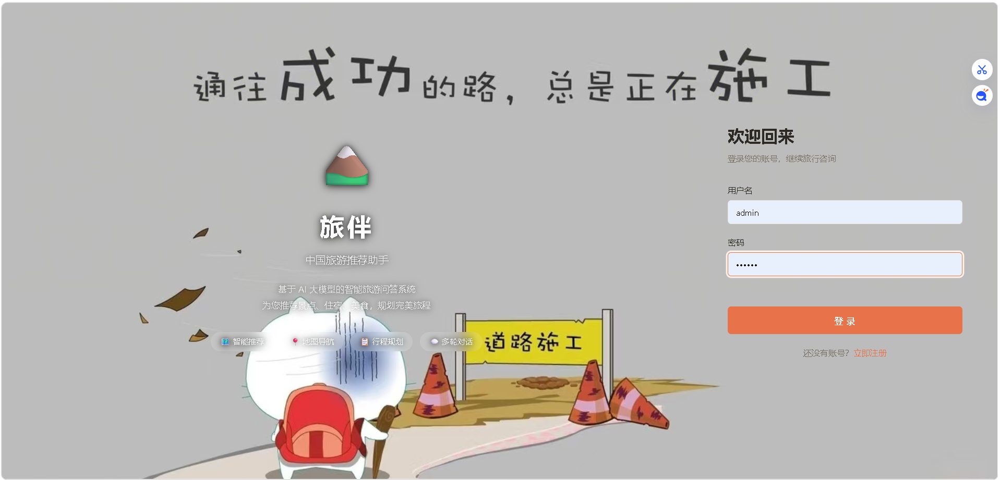
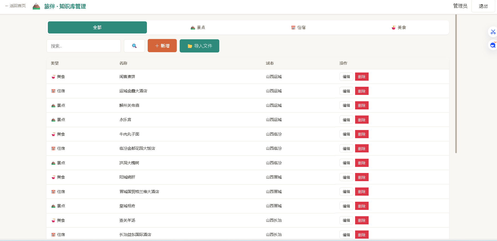
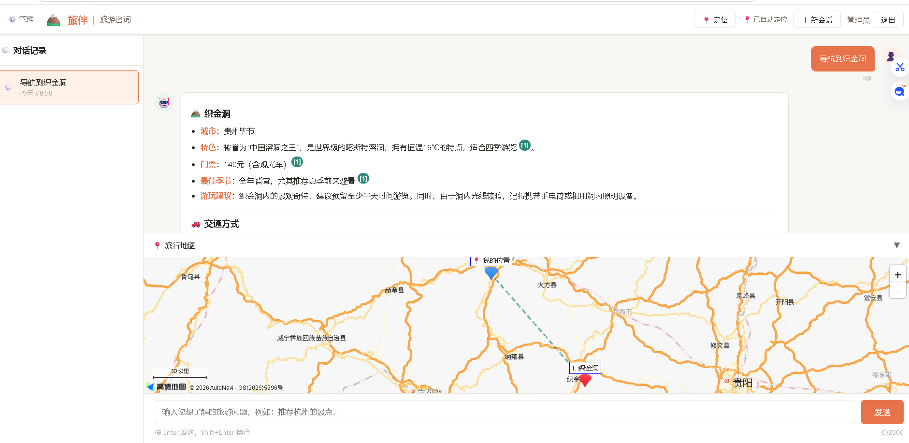
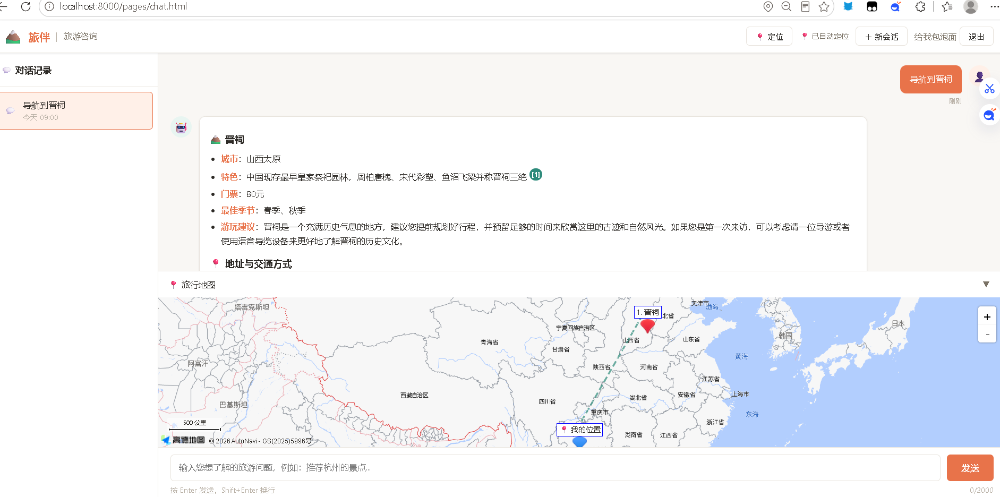
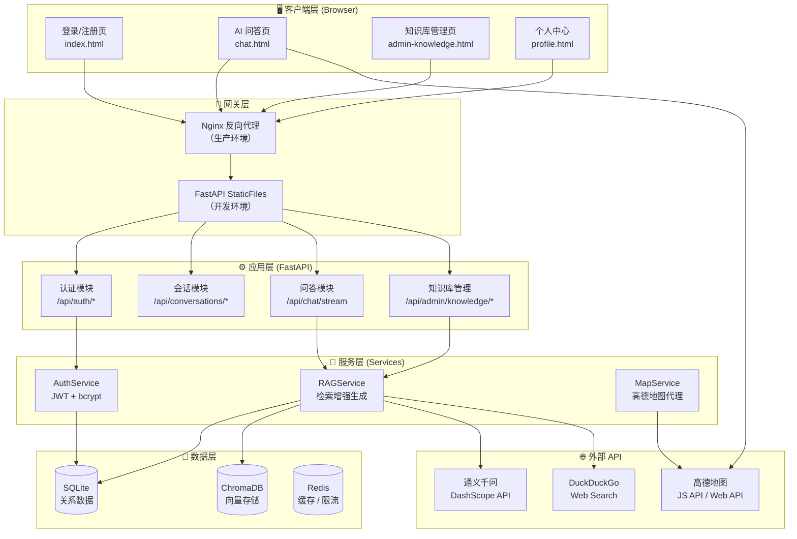
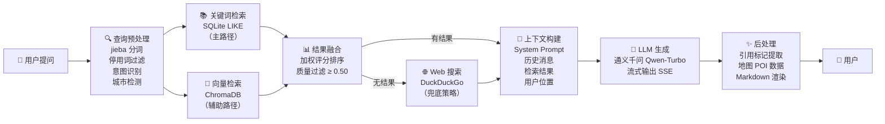
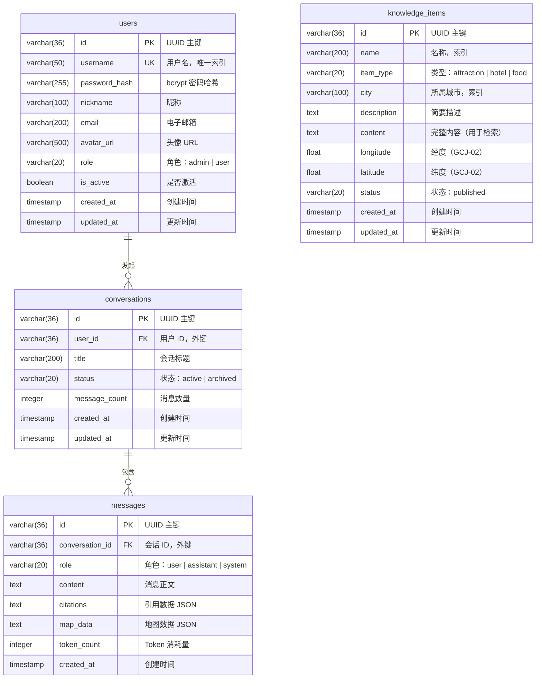

# 旅伴——基于 RAG 与大语言模型的中国旅游智能问答系统

> **Travel Companion: A RAG-Enhanced LLM-Based Q&A System for Chinese Tourism Recommendation**

---

## 摘要

本文介绍了一款面向中国旅游场景的智能问答系统"旅伴"（Travel Companion）。该系统以 FastAPI 异步 Web 框架为后端基础，集成通义千问（Qwen-Turbo）大语言模型与检索增强生成（Retrieval-Augmented Generation, RAG）技术，结合 jieba 中文分词和高德地图 API，实现了针对景点、美食、住宿三类旅游信息的多轮对话式智能推荐。系统采用原生 HTML/CSS/JavaScript 构建单页面应用（SPA），支持 SSE（Server-Sent Events）流式响应、Markdown 富文本渲染、知识库引用溯源以及地理信息可视化。本文详细阐述了系统的架构设计、核心技术选型、数据库建模、检索增强生成管线以及关键功能的实现方案，并对系统的扩展性与可部署性进行了探讨。

**关键词**：大语言模型；检索增强生成；旅游推荐；FastAPI；通义千问；SSE 流式响应

---

## 一、系统运行展示

### 1.1 登录与注册界面

用户通过统一的身份认证入口进入系统。登录页采用全屏旅游主题背景图，左侧为品牌展示区，右侧为登录/注册表单面板。系统区分管理员（`admin`）与普通用户两种角色，登录后按权限路由至不同功能页面。



*图 1-1：系统登录/注册界面*

### 1.2 管理员知识库管理界面

管理员登录后进入知识库管理控制台，可对景点、美食、住宿三类知识条目进行增删改查操作。页面提供按类型筛选、关键词搜索、分页浏览等功能，并支持结构化文本文件的批量导入解析。



*图 1-2：管理员知识库管理界面*

### 1.3 管理员对话界面

管理员同样可使用 AI 问答功能。模型回答以 Markdown 格式渲染，支持多级标题、表格、引用块等富文本元素，文中 `[^N]` 形式的引用标记可点击跳转至对应的知识库引用卡片，地图面板自动展示相关知识点的地理位置。



*图 1-3：管理员与 AI 模型对话界面*

### 1.4 普通用户对话界面

普通用户登录后进入主问答页面，左侧为会话历史列表，中央为对话区域，底部集成高德地图面板。用户可创建多个会话、查看历史对话，系统支持提问快捷入口（如"推荐杭州的景点"）、用户位置自动检测以及 POI 路线导航。



*图 1-4：普通用户与 AI 模型对话界面*

---

## 二、系统功能概述

### 2.1 核心功能清单

| 功能模块 | 功能描述 | 实现状态 |
|----------|----------|:--------:|
| **AI 智能问答** | 基于通义千问（Qwen-Turbo）大语言模型，结合知识库实现流式问答 | ✅ 已实现 |
| **RAG 检索引擎** | jieba 中文分词 + SQLite 关键词匹配 + ChromaDB 向量检索混合策略 | ✅ 已实现 |
| **意图识别** | 自动检测用户查询中的城市名、类别词（景点/美食/住宿），精准过滤 | ✅ 已实现 |
| **引用溯源** | AI 回答中 `[^N]` 标注知识来源，前端渲染为可点击的引用标记与卡片 | ✅ 已实现 |
| **Markdown 渲染** | 基于 marked.js 的富文本输出，支持标题、表格、列表、代码块、引用等 | ✅ 已实现 |
| **地图可视化** | 高德地图 JS API 2.0 集成，POI 标记、信息窗、驾车/公交/步行路线规划 | ✅ 已实现 |
| **多用户多会话** | JWT 认证体系，每用户独立会话空间，对话历史完整持久化 | ✅ 已实现 |
| **管理员控制台** | 知识库 CRUD、分页查询、文本文件批量导入与结构化解析 | ✅ 已实现 |
| **Web 搜索兜底** | 知识库无匹配结果时自动触发 DuckDuckGo 网络搜索作为补充 | ✅ 已实现 |
| **用户位置感知** | 浏览器 Geolocation API + 高德逆地理编码，注入 AI 上下文 | ✅ 已实现 |
| **密码安全管理** | bcrypt 哈希加盐存储，JWT 双 Token 机制（access 30min / refresh 7d） | ✅ 已实现 |

### 2.2 功能亮点

1. **双路径混合检索**：以 jieba 分词 + SQLite LIKE 关键词检索为主路径（精确匹配、响应快速），以 ChromaDB 语义向量检索为辅助路径（语义召回），二者结果按加权分数合并，兼顾准确性与召回率。
2. **多粒度意图识别**：系统对用户查询进行城市名称检测（LIKE 模糊匹配）、类别词检测（子串扫描，覆盖"景点/美食/住宿/酒店/小吃/民宿"等 30+ 词条）、停用词过滤三重预处理，确保检索精度。
3. **全局类型过滤**：当检测到用户查询包含类别词后，该过滤条件应用于所有关键词的 SQL 检索，从根本上避免"搜美食却返回景点"的跨类别污染。
4. **引用质量阈值**：仅展示评分 ≥ 0.50 的知识库条目作为引用来源，低于阈值的检索结果仅作为上下文供模型参考，不向用户展示不可靠的参考来源。
5. **SSE 流式传输**：采用 Server-Sent Events 协议，通过 `fetch` + `ReadableStream` 实现 POST 方式的流式接收（相比 EventSource 支持自定义请求头与请求体），实现 Token 级别的逐字输出。

---

## 三、系统架构设计

### 3.1 整体架构图



*图 3-1：系统整体架构图*

### 3.2 RAG 检索增强生成管线



*图 3-2：RAG 检索增强生成管线*

### 3.3 数据库 ER 图



*图 3-3：数据库实体关系图（ER Diagram）*

> **设计说明**：知识库采用三表合一（`knowledge_items`）的统一模型，通过 `item_type` 字段区分景点（attraction）、住宿（hotel）、美食（food）三类。该设计避免了多表带来的查询复杂度，简化了 CRUD 操作与分页逻辑，同时在 `item_type` 与 `city` 字段上建立了索引以保证按类别和城市的筛选性能。

---

## 四、技术栈详解

### 4.1 技术选型总览

| 层级 | 技术组件 | 版本 | 选型依据 |
|------|----------|------|----------|
| **后端框架** | FastAPI | 0.115 | 原生异步支持，自动 OpenAPI 文档生成，与 Python 异步生态深度整合 |
| **ASGI 服务器** | Uvicorn | 0.34 | 基于 uvloop 的高性能 ASGI 实现，支持热重载开发模式 |
| **ORM** | SQLAlchemy | 2.0 (async) | Python 社区最成熟的 ORM，2.0 版本原生支持异步查询 |
| **关系数据库** | SQLite (aiosqlite) | — | 开发阶段零配置，生产可平滑迁移至 PostgreSQL |
| **向量数据库** | ChromaDB | 0.5 | 轻量级嵌入式向量存储，Python 原生 API，适合 Demo 与小规模部署 |
| **Embedding 模型** | sentence-transformers | 3.3 | 支持中文语义向量化，可选 text2vec-base-chinese 等模型 |
| **LLM 接口** | DashScope | 1.21 | 阿里云通义千问官方 Python SDK，支持流式生成 |
| **LLM 模型** | Qwen-Turbo | — | 中文理解能力优异，免费额度充足，响应延迟低 |
| **中文分词** | jieba | 0.42 | 成熟轻量的中文分词库，精确模式适合短文本关键词提取 |
| **认证** | python-jose + passlib | 3.3 / 1.7 | JWT 标准实现 + bcrypt 密码哈希，安全性有保障 |
| **数据校验** | Pydantic | 2.10 | FastAPI 原生集成，类型安全，序列化性能优秀 |
| **前端** | Vanilla HTML/CSS/JS | ES6+ | 零框架依赖，SPA 架构，模块化 JS 文件组织 |
| **Markdown 渲染** | marked.js | CDN | 轻量级 Markdown 解析器，支持自定义渲染规则 |
| **地图 SDK** | 高德地图 JS API | 2.0 | 国内最完善的 Web 地图 API，POI 数据丰富，免费额度高 |
| **Web 搜索** | ddgs (DuckDuckGo) | — | 无需 API Key 的网络搜索引擎封装，适合作为知识库兜底 |
| **反向代理** | Nginx (alpine) | — | 生产环境静态资源服务 + API 反向代理，SSE 长连接支持 |

### 4.2 前端模块组织

| JS 模块 | 文件路径 | 职责 |
|---------|----------|------|
| `CONFIG` | `frontend/js/config.js` | API 地址、高德 Key、Token 存储键等全局配置 |
| `API` | `frontend/js/api.js` | 统一 HTTP 请求封装，自动注入 Authorization 头，Token 过期自动刷新 |
| `Utils` | `frontend/js/utils.js` | HTML 转义、Toast 提示、日期格式化等工具函数 |
| `ChatState` | `frontend/js/chat.js` | 聊天核心状态管理：SSE 流式接收、消息渲染、会话切换 |
| `MapView` | `frontend/js/map.js` | 高德地图封装：POI 标记、路线绘制、信息窗、附近搜索 |
| `renderMarkdown` | `frontend/js/markdown.js` | marked.js 配置：引用上标化、表格包装、链接新窗口打开 |
| `Auth` | `frontend/js/auth.js` | 登录/注册表单逻辑、Token 管理、登录状态检测 |

---

## 五、API 接口规范

### 5.1 认证接口 `/api/auth`

| 方法 | 路径 | 认证 | 说明 |
|:------|:------|:----:|:-----|
| POST | `/api/auth/register` | ❌ | 用户注册（用户名 ≥2 位，密码 ≥6 位） |
| POST | `/api/auth/login` | ❌ | 登录，返回 `access_token` + `refresh_token` + 用户信息 |
| POST | `/api/auth/refresh` | ❌ | 刷新令牌（需在请求体提供 `refresh_token`） |
| GET | `/api/auth/me` | ✅ | 获取当前登录用户信息 |
| PUT | `/api/auth/password` | ✅ | 修改密码（需提供旧密码） |
| POST | `/api/auth/logout` | ✅ | 登出（客户端清除 Token） |

### 5.2 会话接口 `/api/conversations`

| 方法 | 路径 | 认证 | 说明 |
|:------|:------|:----:|:-----|
| GET | `/api/conversations` | ✅ | 获取当前用户会话列表（分页，按更新时间倒序） |
| POST | `/api/conversations` | ✅ | 创建新会话（标题自动从首条消息截取） |
| GET | `/api/conversations/{id}` | ✅ | 获取会话详情与完整消息历史 |
| PUT | `/api/conversations/{id}` | ✅ | 更新会话标题或状态（active / archived） |
| DELETE | `/api/conversations/{id}` | ✅ | 软删除会话（标记为 archived） |

### 5.3 核心问答接口 `/api/chat`

| 方法 | 路径 | 认证 | 说明 |
|:------|:------|:----:|:-----|
| POST | `/api/chat/stream` | ✅ | **SSE 流式问答**，支持多轮对话上下文与地图数据回传 |

**SSE 事件类型**：

| 事件 | 数据结构 | 说明 |
|------|----------|------|
| `token` | `{"text": "..."}` | 逐 Token 增量文本 |
| `citation` | `{"kb_items": [{...}]}` | 知识库引用条目（id, title, type, snippet, score） |
| `map` | `{"type": "poi", "pois": [{...}]}` | 地图 POI 坐标数据（name, longitude, latitude） |
| `done` | `{"message_id": "...", ...}` | 流式生成完成信号 |
| `error` | `{"code": "...", "message": "..."}` | 异常信息 |

### 5.4 知识库管理接口 `/api/admin/knowledge`（管理员专用）

| 方法 | 路径 | 认证 | 说明 |
|:------|:------|:----:|:-----|
| GET | `/api/admin/knowledge` | 🔒 | 知识库列表（分页 + type/city/search 筛选） |
| GET | `/api/admin/knowledge/{id}` | 🔒 | 获取单条知识详情 |
| POST | `/api/admin/knowledge` | 🔒 | 新增知识条目 |
| PUT | `/api/admin/knowledge/{id}` | 🔒 | 更新知识条目 |
| DELETE | `/api/admin/knowledge/{id}` | 🔒 | 删除知识条目 |
| POST | `/api/admin/knowledge/batch-import` | 🔒 | 批量导入（`=== 类型：名称 ===` 结构化文本解析） |

---

## 六、部署与运行指南

### 6.1 环境要求

| 依赖项 | 最低版本 | 说明 |
|--------|:--------:|------|
| Python | 3.10+ | 异步语法（`async/await`）与类型注解支持 |
| pip | 22.0+ | Python 包管理器 |
| Git | 2.30+ | 版本控制与仓库克隆 |
| 通义千问 API Key | — | 在[阿里云百炼平台](https://bailian.console.aliyun.com/)申请 |
| 高德地图 JS API Key | — | 在高德开放平台申请（Web 端 JS API），系统已内置演示 Key |

### 6.2 安装步骤

**第一步：克隆仓库**

```bash
git clone https://gitee.com/convenientnoodle13/chinese-travel.git
cd chinese-travel
```

**第二步：创建虚拟环境并安装依赖**

```bash
python -m venv venv

# Windows
venv\Scripts\activate

# macOS / Linux
source venv/bin/activate

pip install -r requirements.txt
```

**第三步：配置环境变量**

在 `backend/` 目录下创建 `.env` 文件：

```ini
DASHSCOPE_API_KEY=sk-your-api-key-here
AMAP_API_KEY=your-amap-web-service-key
JWT_SECRET=your-random-secret-string
DEBUG=True
```

**第四步：初始化数据库并启动服务**

```bash
cd backend
python -m uvicorn app.main:app --host 0.0.0.0 --port 8000 --reload
```

**第五步：访问系统**

- 浏览器打开 `http://localhost:8000`
- 管理员账号：`admin` / `123456`
- 普通用户：在登录页点击"立即注册"创建新账号

### 6.3 知识库数据导入

**方式一：单条新增**

登录管理员账号 → 进入知识库管理页 → 点击"新增条目" → 填写表单 → 保存。

**方式二：批量结构化导入**

准备 `.txt` 文件，格式如下：

```
=== 景点：平遥古城 ===
城市：山西晋中
描述：平遥古城是中国保存最为完好的四大古城之一...

=== 美食：刀削面 ===
城市：山西大同
描述：刀削面是山西最负盛名的面食...

=== 住宿：平遥云锦成客栈 ===
城市：山西晋中
描述：位于平遥古城内的精品民宿...
```

进入知识库管理页 → 点击"导入文件" → 选择 `.txt` 文件 → 系统自动解析并逐条导入。

### 6.4 项目目录结构

```
tourism-qa-system/
├── backend/                        # Python FastAPI 后端
│   ├── main.py                     # 应用入口，生命周期管理
│   ├── config.py                   # pydantic-settings 配置管理
│   └── app/
│       ├── api/                    # 路由层
│       │   ├── auth.py             #   认证接口
│       │   ├── chat.py             #   SSE 流式问答接口
│       │   ├── conversation.py     #   会话管理接口
│       │   └── knowledge.py        #   知识库 CRUD 接口
│       ├── models/                 # SQLAlchemy ORM 模型
│       │   ├── user.py             #   用户模型
│       │   ├── conversation.py     #   会话 & 消息模型
│       │   └── knowledge.py        #   知识库统一模型
│       ├── schemas/                # Pydantic 请求/响应 Schema
│       └── services/               # 核心业务服务
│           └── rag_service.py      #   RAG 检索 + LLM 流式生成
├── frontend/                       # Vanilla JS 前端
│   ├── index.html                  # 入口页（登录/注册）
│   ├── pages/
│   │   ├── chat.html               #   AI 问答主页面
│   │   ├── admin-knowledge.html    #   知识库管理控制台
│   │   └── profile.html            #   个人中心
│   ├── css/
│   │   ├── common.css              #   全局样式与 CSS 变量
│   │   ├── auth.css                #   登录注册页样式
│   │   ├── chat.css                #   聊天界面样式
│   │   └── admin.css               #   管理后台样式
│   ├── js/
│   │   ├── api.js                  #   HTTP 请求封装
│   │   ├── chat.js                 #   聊天核心逻辑 + SSE
│   │   ├── map.js                  #   高德地图封装
│   │   └── markdown.js             #   Markdown 渲染
│   └── assets/
│       ├── images/                 #   截图与图片资源
│       │   ├── b1.png              #     登录界面截图
│       │   ├── b2.png              #     管理员后台截图
│       │   ├── b3.png              #     管理员对话截图
│       │   └── b4.png              #     用户对话截图
│       └── icons/                  #   SVG 图标
├── scripts/                        # 运维脚本
│   └── import_knowledge.py         #   知识库批量导入 + 向量化
├── data/                           # 知识库种子数据（JSON）
│   ├── attractions.json
│   ├── hotels.json
│   └── foods.json
├── requirements.txt                # Python 依赖清单
├── CLAUDE.md                       # 项目开发指南
└── RECOMMEND.md                    # 本文件
```

---

## 七、关键实现细节

### 7.1 检索评分算法

知识库检索采用自定义加权评分函数，综合考虑关键词长度、匹配位置与匹配类型：

```python
def _score_item(item, keyword: str) -> float:
    """
    单关键词 → 单知识条目评分
    - 名称完全匹配：0.60
    - 名称部分匹配：0.55
    - 城市匹配：0.45 ~ 0.55（关键词越长权重越高）
    - 内容匹配：0.35 ~ 0.50
    - 类别词（"景点"/"美食"/"住宿"等）权重减半（0.20）
    """
    kw_len = len(keyword)
    weight = min(kw_len / 6.0, 1.0)  # 6 字及以上关键词权重最高

    if keyword in item.name:
        return 0.55 + weight * 0.05
    if keyword in item.city:
        return 0.45 + weight * 0.10
    if keyword in item.content:
        return 0.35 + weight * 0.15
    return 0.0
```

### 7.2 类别词检测机制

系统维护预定义的类别词映射表，采用子串匹配（而非精确匹配）以覆盖 jieba 分词可能导致的词语粘连问题：

```python
_CATEGORY_PAIRS = [
    ("景点", "attraction"), ("景区", "attraction"), ("风景", "attraction"),
    ("美食", "food"), ("小吃", "food"), ("火锅", "food"),
    ("住宿", "hotel"), ("酒店", "hotel"), ("民宿", "hotel"),
    # ... 共 30+ 组映射
]

def _detect_category(kw: str) -> str | None:
    for cat_word, cat_type in _CATEGORY_PAIRS:
        if cat_word in kw:  # 子串匹配
            return cat_type
    return None
```

一旦任一关键词触发类别匹配，该类别将作为**全局过滤条件**应用于所有关键词的 SQL 查询，从根本层面杜绝跨类别污染。

### 7.3 SSE 流式传输实现

前端采用 `fetch` + `ReadableStream` 方案而非浏览器原生 `EventSource`，理由如下：

1. `EventSource` 仅支持 GET 请求，无法携带 Authorization 头与复杂请求体；
2. `fetch` 方案支持 POST 方法，可在请求体中传递 `conversation_id`、`options`（含用户位置）等参数；
3. 通过自定义 `X-Accel-Buffering: no` 响应头可禁用 Nginx 缓冲，保证流式数据的实时传输。

```javascript
const response = await fetch(`${CONFIG.API_BASE}/api/chat/stream`, {
    method: 'POST',
    headers: {
        'Content-Type': 'application/json',
        'Authorization': `Bearer ${API.getToken()}`,
    },
    body: JSON.stringify({ conversation_id, message, options }),
});

const reader = response.body.getReader();
const decoder = new TextDecoder();
// 持续读取流数据，解析 SSE 事件...
```

---

## 八、安全设计

| 安全层面 | 实施方案 |
|----------|----------|
| **密码存储** | bcrypt + 随机盐，迭代 12 轮（passlib CryptContext） |
| **传输认证** | JWT HS256 签名，access_token 有效期 30 分钟，refresh_token 有效期 7 天 |
| **SQL 注入防护** | SQLAlchemy 2.0 参数化查询，无字符串拼接 SQL |
| **XSS 防护** | 用户消息使用 `Utils.escapeHtml()` 转义；AI 回复经 marked.js 安全渲染 |
| **权限控制** | 管理员接口通过 `require_admin` 依赖注入验证 `role == "admin"`，非管理员返回 403 |
| **CORS 策略** | 开发环境 `allow_origins=["*"]`，生产环境通过 `.env` 配置白名单 |
| **敏感信息保护** | API Key、JWT Secret 通过 `.env` 注入，`.gitignore` 排除提交 |

---

## 九、总结与展望

### 9.1 当前成果

"旅伴"系统已完成从用户认证、知识库管理、RAG 智能问答到地图可视化的全链路闭环。当前知识库涵盖山西省 11 个地市及全国热门目的地的 74 项旅游条目（33 景点 / 21 美食 / 20 住宿），支持自然语言多轮对话、Markdown 富文本呈现、引用溯源与路径导航等核心功能。

### 9.2 后续改进方向

| 方向 | 具体措施 |
|------|----------|
| **全文检索升级** | 引入 Elasticsearch 或 PostgreSQL `pg_trgm` 全文索引替代 SQLite LIKE 模糊匹配，提升大数据量下的检索性能与召回率 |
| **语义检索增强** | 完善 ChromaDB 向量检索权重，实现 BM25 + Dense Retrieval 的 RRF 融合排序 |
| **AI 行程规划** | 基于多轮对话的智能行程生成（多日、多城市、含交通衔接），支持导出为结构化 JSON 或图片 |
| **知识图谱构建** | 建立"景点—城市—美食—住宿"实体关系网络，支持关联推荐与路径优化 |
| **用户反馈闭环** | 回答 👍/👎 评分自动回写知识库质量分数，驱动内容优化 |
| **容器化部署** | 完善 Docker Compose 编排，支持 PostgreSQL + Redis + ChromaDB 一键启动 |
| **移动端适配** | 响应式布局优化 + PWA 离线缓存 + Web Speech API 语音输入 |

---

## 参考文献

1. Lewis, P., et al. *Retrieval-Augmented Generation for Knowledge-Intensive NLP Tasks.* NeurIPS, 2020.
2. FastAPI Documentation. *Async Web Framework for Python.* https://fastapi.tiangolo.com/
3. DashScope API Documentation. *Tongyi Qianwen Model Service.* https://help.aliyun.com/document_detail/dashscope.html
4. 高德开放平台. *JS API 2.0 参考手册.* https://lbs.amap.com/api/javascript-api-v2/summary
5. ChromaDB Documentation. *Open-source Embedding Database.* https://docs.trychroma.com/
6. SQLAlchemy 2.0 Documentation. *Unified Tutorial — Asynchronous I/O.* https://docs.sqlalchemy.org/en/20/orm/extensions/asyncio.html

---

> **项目地址**：https://gitee.com/convenientnoodle13/chinese-travel
>
> **最后更新**：2026 年 7 月
